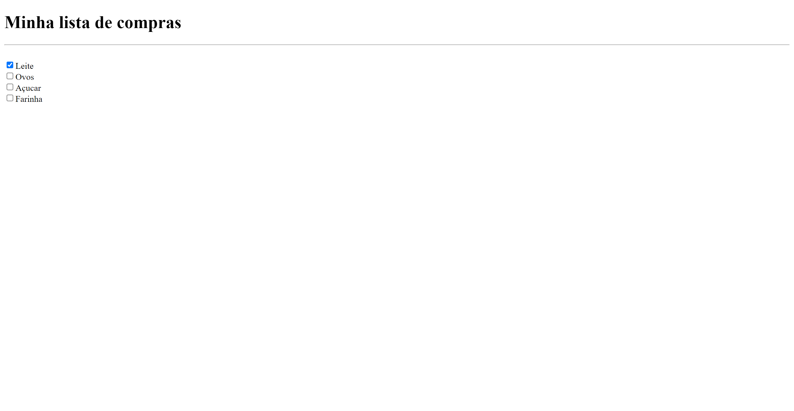

# Lista de Compras

## Projeto 💻
Projeto de um desafio da Rocketseat de uma série de desafios básicos para praticar os conhecimentos em HTML.

## Instalação 🛠
Siga esses passos para instalar o repositório na sua máquina:
1. Rode `git clone https://github.com/miishiyama/Desafios-HTML` para fazer um clone desse repositório.

## Tecnologias 🚀
As tecnologias utilizadas neste projeto são:
- HTML
- CSS

## Créditos ❤️
Feito por [Millene Eduarda Ishiyama](https://github.com/miishiyama/).
